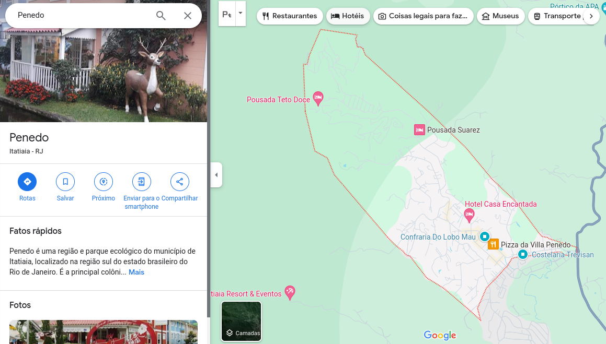
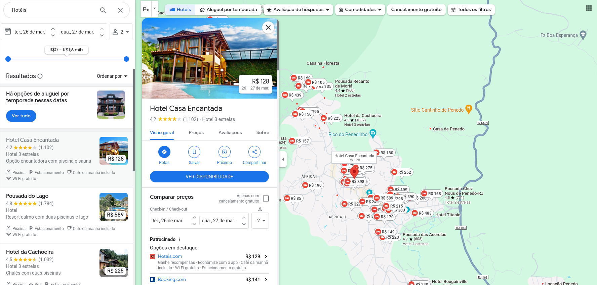
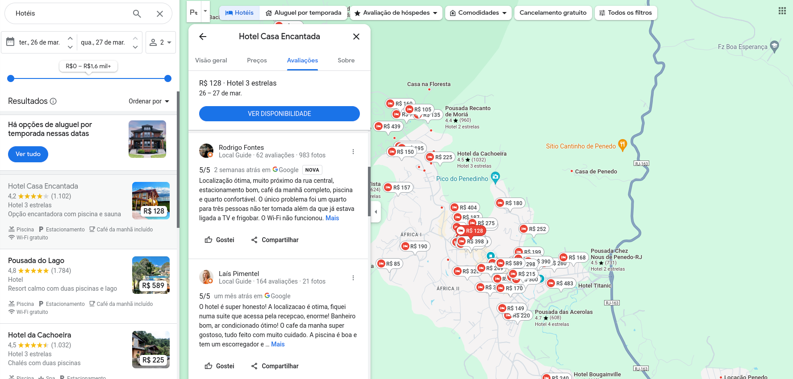

# Crawler Hotéis Google

## Contexto
A busca de hotéis através do Google Maps é uma ferramenta valiosa para os viajantes por várias razões. Primeiro, o Google Maps é uma plataforma amplamente utilizada e confiável para navegação e descoberta de locais. Ao integrar a busca de hotéis, os viajantes podem encontrar facilmente acomodações próximas às áreas que desejam explorar.

Além disso, o Google Maps fornece informações detalhadas sobre os hotéis, incluindo avaliações de usuários, fotos, preços e disponibilidade. Esses detalhes ajudam os viajantes a tomar decisões informadas com base em suas preferências e orçamento.

Assim, o Google Maps é uma ferramenta buscada, por futuros hospedes, devido as seguintes razões:

- Facilidade de Acesso;
- Informações Abrangentes;
- Confiabilidade e Credibilidade;

Isso habilita o Google Maps como uma fonte de dados relevante e confiável para explorar e analisar características das hospegens e com isso, tentar gerar alguns insights.

## Objetivo
Extrair dados referentes aos avaliações postadas, na plataforma do Google Maps, pelos frequentadores das hospedagens. Para isso, simulamos a interação humana com a plataforma para extrair essas avaliações. Ao fim, teremos 3 categorias de informação por meio da Plataforma:

- Informações gerais das hospedagens (hotéis);
- Preços base para cada hospedagem listada na plataforma;
- Comentários dos hospedes para respectiva hospedagem;

## Ferramentas & Estratégia
Utilizamos duas ferramentas (Scrapy e Playwright) para atender ao objetivo acima. Assim, foi desenvolvido script em Python para emular as interações com a página do Google Maps e extrair os dados **resultantes** dessas interações.

### Scrapy

O Scrapy é uma ferramenta em Python para extrair dados de sites de maneira automatizada. Ele simplifica a coleta de informações na web, permitindo aos desenvolvedores criar "spiders" que navegam por páginas, coletam dados estruturados e os armazenam em formatos como JSON ou CSV. Essa integração é útil para uma variedade de finalidades, como mineração de dados, monitoramento de preços e indexação de conteúdo na web.

### Playwright

O Playwright é uma ferramenta de automação de navegador desenvolvida pela Microsoft Edge Team. Sua finalidade principal é automatizar a interação com páginas da web, permitindo aos desenvolvedores simular ações do usuário, como clicar em botões, preencher formulários e navegar por sites. Essa integração é valiosa para testes automatizados e para criar scripts de automação para tarefas repetitivas na web.

### Integração

Ao integrar essas duas ferramentas, os desenvolvedores podem aproveitar as capacidades de automação do Playwright para navegar dinamicamente por páginas da web e extrair dados, enquanto o Scrapy organiza e gerencia o processo de scraping de uma forma estruturada e escalável. Isso oferece aos desenvolvedores uma solução poderosa e flexível para a coleta de dados na web, com suporte a JavaScript, AJAX, renderização dinâmica e outras complexidades encontradas em páginas modernas da web. 

### Estratégia
Antes de extrair os dados temos que especificar os dados de interesse. Para buscar pelos hoteis no Maps, temos:
-   Inserir a região de interesse na plataforma;
-   Clicar na guia hotéis para listar os hoteís disponíveis na região;

Isso retorna uma lista de hostéis para a região geográfica específicada e monta o ponto de partida para a extração de dados do web crawler no Maps.

Os dados gerados por esse web crawler são extraídos via requisições de API. Para isso, simulamos algumas interações humanas com o Google Maps e filtramos as requisições das API de interesse. As APIs filtradas retornam um arquivo no formato *json* composto somente por um conjunto de listas.

As informações gerais dos hoteis e preços ofertados online são oriundos de uma API filtrada ao clicar no hotel de interesse. 

As avaliações são oriundas de uma API filtrada ao rolar a lista de avaliaçãoes, cada interação retorna uma nova API refentes as novas avaliações carregadas na plataforma Maps.

    
    

OS dados extraídos dessas APIs são organizados em suas respectivas categorias e são armazenados no formato *jsonlines*.

## Padrão dos outputs

Os arquivos gerados pela raspagem estão no formato *jsonlines* e são armazenados no diretório [raw](./raw/) em 3 diferentes diretórios para as respectivas categorias:

- [**Hotels**](./raw/hotels/);
- [**Prices**](./raw/prices/);
- [**Reviews**](./raw/reviews/);

Esses diretórios são particionados por data com os respectivos arquivos *jsonlines*. Cada arquivo *jsonlines* é armazenado sequencialmente com nomes padronizados, onde cada arquivo contém no máximo 2048 items catalogados. 

    

O padrão destes arquivos são definidos da seguinte maneira:

### Hotels
Informações gerais para as hospedagens presentes na plataforma Google Maps.

| Campo | Definição | Tipo |
|-------|-----------|------|
| **id** | código *id* gerado pelo Google para a hospedagem | **String** |
| **name** | nome da hospegadem na plataforma Google | **String** |
| **address** | logradouro da hospedagem | **String** |
| **city_province** | cidade e estado da hospedagem (separados por '-') | **String** |
| **zip_code** | código CEP da hospedagem | **String** |
| **longitude** | coordenada de longitude | **Float** |
| **latitude** | coordenada de latitude | **Float** |
| **phone** | número telefone disponibilidado pela hospedagem | **String** |
| **link** | link disponivel para hospdagem no Google maps | **String** |
| **datetime** | registro para data e hora da raspagem do item | **String** |

### Prices
Preços divulgados para as hospedagens na plataforma Google Maps.

| Campo | Definição | Tipo |
|-------|-----------|------|
| **hotel_id** | código *id* gerado pelo Google para a hospedagem | **String** |
| **hotel_name** | nome da hospegadem na plataforma Google | **String** |
| **service_name** | nome do serviço de reserva para respectiva hospedagem | **String** |
| **price** | preço anunciado pelo serviço de reserva para respectiva hospedagem | **String** |
| **service_id** | código *id* gerado pelo Google para o serviço de reserva para respectiva hospedagem | **String** |
| **datetime** | registro para data e hora da raspagem do item | **String** |

### Reviews
Comentários postados por hospedes e usuários Google/Tripadvisor para as hospedagens presentes na plataforma Google Maps.

| Campo | Definição | Tipo |
|-------|-----------|------|
| **id** | código *id* gerado pelo Google para o usuario/hospede | **String** |
| **review_age** | datação do comentário relativo a data da raspagem do comentário | **String** |
| **hotel_id** | código *id* gerado pelo Google para a hospedagem | **String** |
| **hotel_name** | nome da hospegadem na plataforma Google | **String** |
| **score** | nota geral dada pelo hospede para hospedagem (Mín: 0, Máx: 5) | **String** |
| **language** | idioma detectado pelo Google para o mentario | **Integer** |
| **type_trip** | classificação da viagem para hospedagem | **String** |
| **group_trip** | classificação do grupo de pessoas para hospedagem | **String** |
| **room_rating** | nota específica para o quarto da hospedagem (Mín: 0, Máx: 5) | **Integer** |
| **service_rating** | nota específica para o serviço de quarto da hospedagem (Mín: 0, Máx: 5) | **Integer** |
| **location_rating** | nota específica para a localização da hospedagem (Mín: 0, Máx: 5) | **Integer** |
| **guest_reviews** | total de comentários realizados pelo hospede no Google até o dia da raspagem | **Integer** |
| **guest_photos** | total de fotos postadas pelo hospede no Google até o dia da raspagem | **Integer** |
| **highlights_hotel** | item de destaque para hospedagem na perspectiva do hospede| **String** |
| **source** | origem do comentário (Google ou Tripadvisor) | **String** |
| **datetime** | registro para data e hora da raspagem do item | **String** |
| **positive_review** | comentário positivo descritivo realizado pelo hospede sobre a hospedagem  | **String** |
| **negative_review** | comentário negativo descritivo realizado pelo hospede sobre a hospedagem  | **String** |

## Como executar o crawler

Podemos executar via terminal no diretório do crawler [hotel_reviews_google](./hotel_reviews_google/) o seguinte comando:

    scrapy crawl hotel_reviews_google

A partir desse comando, o scrapy gerencia o processo de scraping enquanto o playwright emula as interações com a pagina do Google Maps para propiciar a extração dos dados. Por fim, são apresentadas as estatistícas do processo no proprio terminal.

https://www.google.com/maps/place/Pousada+Bela+Vista/@-22.4321596,-44.5545511,15z/data=!4m14!1m3!2m2!1zSG90w6lpcw!6e3!3m9!1s0x9e79f1fb93cc93:0x72067e98f9cf0004!5m2!4m1!1i2!8m2!3d-22.4321596!4d-44.5365267!15sCgdIb3TDqWlzkgEFaG90ZWzgAQA!16s%2Fg%2F1tkbzftj?entry=ttu
